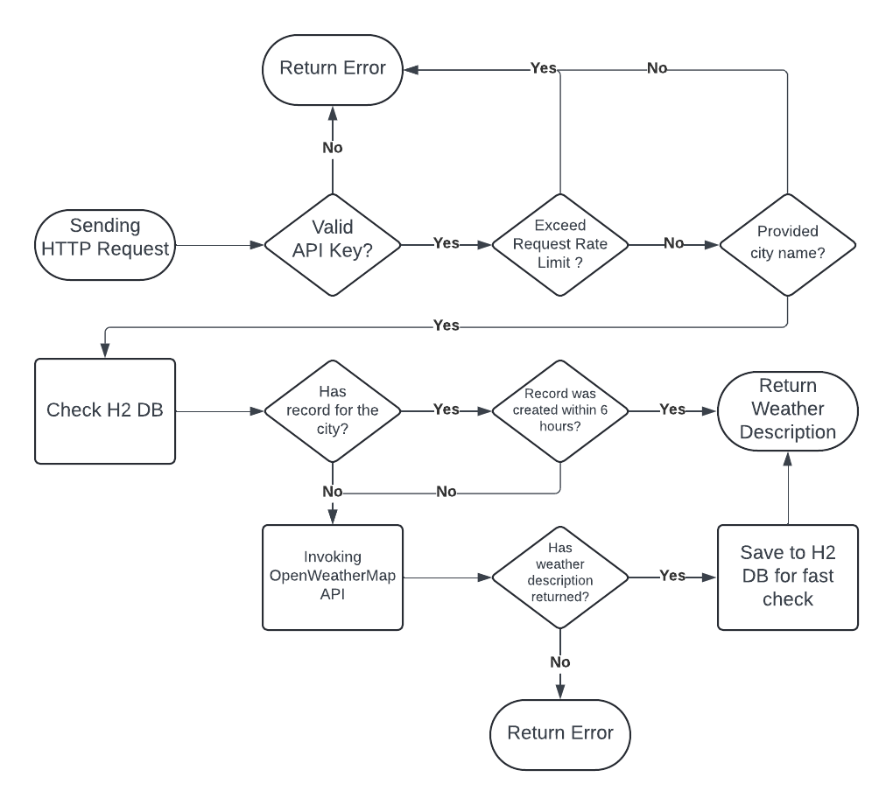

# Weather Restful API

this API can be used to get current weather for given city through open weather API (http://api.openweathermap.org/data/2.5/weather).

* [API Design](#api-design)
    * [API workflow](#flowchart-for-the-api)
    * [Requirements and Implementations](#requirements-and-implementations)
* [API Details](#api-details)
    * [Sample Request](#sample-request-import-to-postman-for-testing)
    * [Sample Response](#sample-response)
* [Assumptions and Trade-offs](#assumptions-and-trade-offs)

## How To Execute the API 
1. Clone the repo
    ```
    git clone https://github.com/ZK-L/WeatherRestfulAPI.git
    ```
2. Change to the directory of the cloned project
    ```
    cd WeatherRestfulAPI\weather
    ```
3. Build the project
    on linux
    ```
    ./gradlew build
    ```
    on windows
    ```
    .\gradlew.bat build
    ```
4. Run the Application
    on linux
    ```
    ./gradlew run
    ```
    on windows
    ```
    .\gradlew.bat run
    ```
5. Now the API should runing on port 8080. Using Postman to test the API. Please refer to [sample request](#sample-request-import-to-postman-for-testing).
## API Design

### Flowchart for the API

* _Below chart shows the workflow of the API_



### Requirements and Implementations 

1. Enforce API Key scheme
    * Using 5 simple string constant as API keys.
    * Customize a request filter by extenting `OncePerRequestFilter` class to valid API keys and manage the request rate for each API key.
    * Applying Google Guava’s `RateLimiter` to control the request rate to allow 5 / 3600 (requests per second).
2. Create an endpoint that accepts both a city name and country name to get weather description 
    * Using `RestController` and `GetMapping` to create the GET endpoint
    * Using `RestTemplate` to invoke the OpenWeatherMap API to get the weather data for the request city 
3. Apply H2 database to store the weather data
    * Define weather JPA entity class to represent the weather data stored in database.
    * Create a repository by extending the `JpaRepository` to interact with the database.
4. Handle errors and providing meaningful error message 
    * Using `RestControlerAdvice` to create a global exception handler to handle exceptions across all REST controller.
    * Customize exceptions to provide more meaningful error message

## API Details

`Endpoint`: /api/currentweather

`Http Method`: GET

### Sample Request (_Import to Postman for testing_):

```
curl --location 'localhost:8080/api/currentweather?cityName=sydney,AU' \
--header 'x-api-key: apikey1'
```

* `cityName`(required): The weather of the city you want to check. Consists of city name and country code divided by comma. Please use ISO 3166 country codes. 
* `x-api-key`(required): API key to grant access to the API. Existing API keys are: apikey1, apikey2, apikey3, apikey4, apikey5.

### Sample Response:

```
Current Weather in sydney,AU: broken clouds
```

## Assumptions and Trade-offs

1. Currently, the request rate limit was achived by using Google Guava’s `RateLimiter` which uses the token bucket algorithm. It lacks persistence and only suitable for small-scale, straightforward rate limiting needs. Using Redis could achieve better outcome and can handle a large number of requests.
2. The H2 database stores data in memory by default, leading to data loss upon application restart. Configure H2 to persist data on disk by specifying a JDBC URL that points to a file location allows the database to retain its state and avoid data loss.  